# Домашнее задание по теме "SQLite practice"

## Приложение «Потребительская корзина»

Необходимо написать приложение по созданию чека при покупке продуктов в магазине с использованием базы данных **SQLite**.  При покупке продукта, мы заносим данные этого продукта в поля: названия продукта, вес, цена. При нажатии кнопки **«Сохранить»** продукт сохраняется в базе данных и появляется в списке самого приложения. Список это и будет чек, который формируется в процессе покупок. Кроме того, в **Toolbar** есть пункт меню «**Exit**» для выхода из приложения. Для формирования списка необходимо будет создать свой кастомный адаптер со всеми необходимыми для этого элементами.

Для работы приложения необходимо создать:

На экране:

1. **Toolbar** с заголовком.

2. Поля ввода данных: название продукта, вес, цена.

3. Список купленных продуктов **ListView**.

4. Кнопка **«Сохранить»** для сохранения купленных продуктов в базу данных.

5. Меню с одним пунктом **«Exit»**.

Необходимо учесть, что при сохранении продуктов, мы его сразу отображаем в списке – чеке, т.е. по нажатию на кнопку, происходит не только сохранение, но и считывание данных из базы для их отображения в списке.

Приложение необходимо сохранить проектом в удаленном репозитории, для проверки качества предоставить ссылку преподавателю, либо сделать скрины эмулятора при каждом шаге работы приложения или видео работы реального устройства.

## Скриншоты домашнего здания по теме "SQLite practice"

Скриншоты спрятались

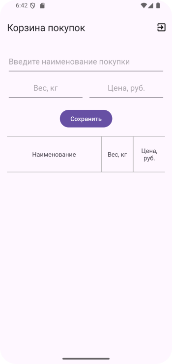
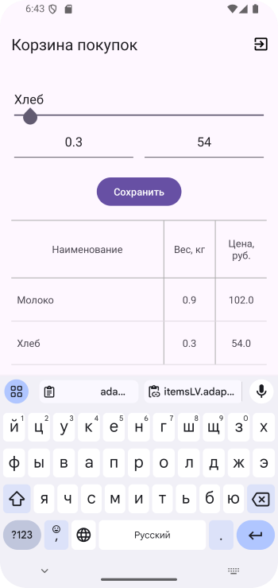
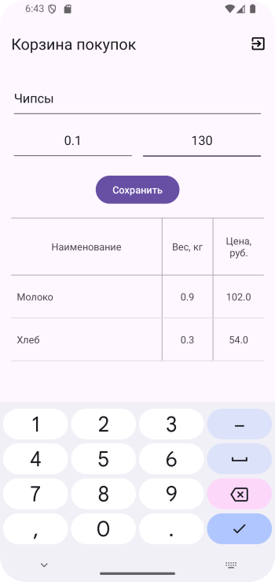
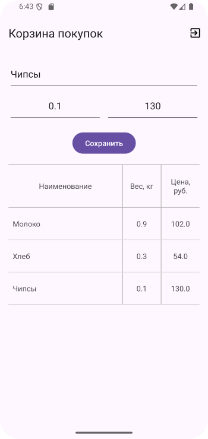
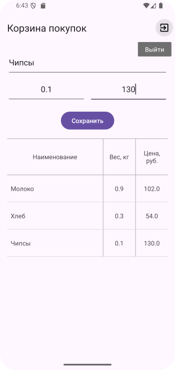

# Домашнее задание по теме "SQLite practice 2"

## Приложение «Потребительская корзина»

Необходимо доработать приложение по созданию чека при покупке продуктов в магазине с использованием базы данных SQLite. 

***История создания.*** При покупке продукта, мы заносим данные этого продукта в поля: названия продукта, вес, цена. При нажатии кнопки **«Сохранить»** продукт сохраняется в базе данных и появляется в списке самого приложения. Список это и будет чек, который формируется в процессе покупок. Кроме того, в **Toolbar** есть пункт меню **«Exit»** для выхода из приложения. Для формирования списка необходимо будет создать свой кастомный адаптер со всеми необходимыми для этого элементами.

***Доработать.*** На экране также добавлены две кнопки. Кнопка **«Изменить»** по нажатию на которую можно поменять имеющуюся запись и обновить запись в базе данных с таким расчетом, чтобы список на экране обновился после внесения изменений. Кнопка **«Удалить»** по нажатию на которую по id удаляется элемент из базы данных и обновленный список на экране снова перерисовывается.

Для работы приложения необходимо создать:

На экране:

1. **Toolbar** с заголовком.

2. Поля ввода данных: название продукта, вес, цена.

3. Список купленных продуктов **ListView**.

4. Кнопка **«Сохранить»** для сохранения купленных продуктов в базу данных.

5. Кнопка **«Изменить»** для внесения изменений в поле купленного продукта и обновления базы данных.

6. Кнопка **«Удалить»** для удаления купленного продукта из списка чека и базы данных.

7. Меню с одним пунктом **«Exit»**.

Необходимо учесть, что при сохранении продуктов, мы его сразу отображаем в списке – чеке, т.е. по нажатию на кнопку, происходит не только сохранение, но и считывание данных из базы для их отображения в списке.

**\*\*\* Необязательно, но желательно (усложненный уровень).**

Обновление и удаление элементов из базы данных реализовать по нажатию на элемент списка на экране. При этом выполняется переход на диалоговое окно с выбором операций обновления, удаления или отмены. При выборе кнопки обновления реализация может быть разной: переход на новое активити, либо с использованием диалогового окна.

Приложение необходимо сохранить проектом в удаленном репозитории, для проверки качества предоставить ссылку преподавателю, либо сделать скрины эмулятора при каждом шаге работы приложения или видео работы реального устройства.

## Скриншоты домашнего здания по теме "SQLite practice 2"

Эти скриншоты тоже спрятались

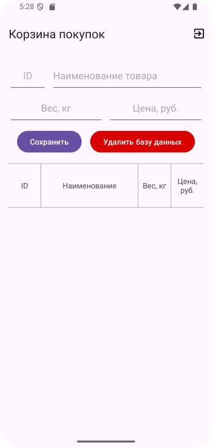

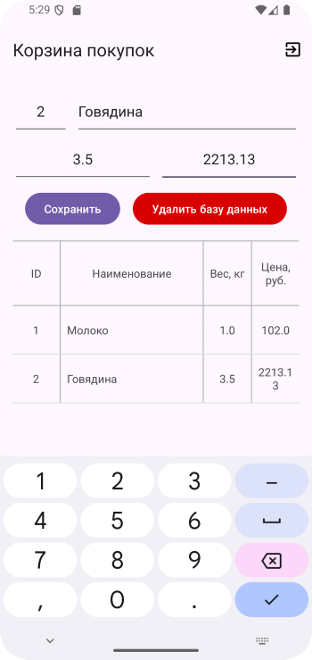
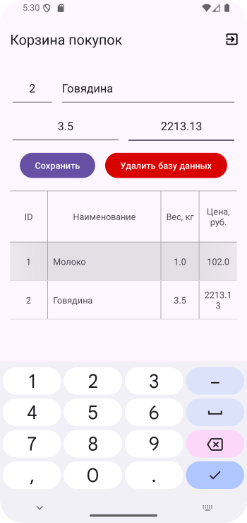
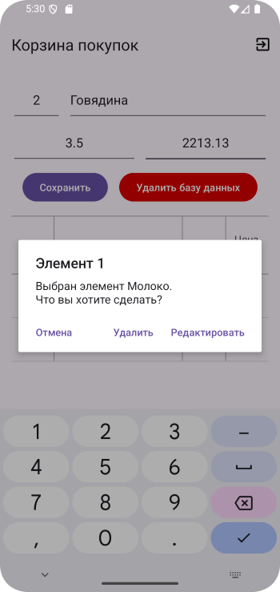
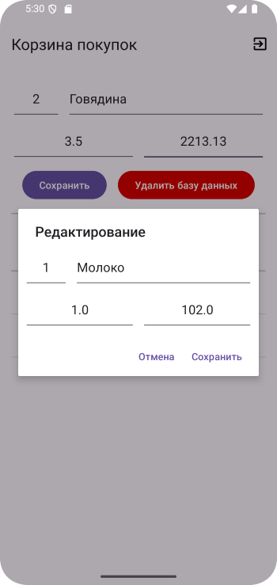
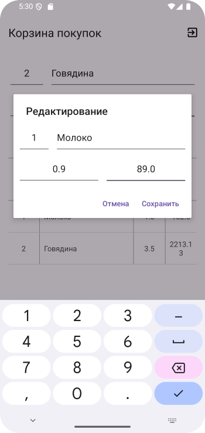
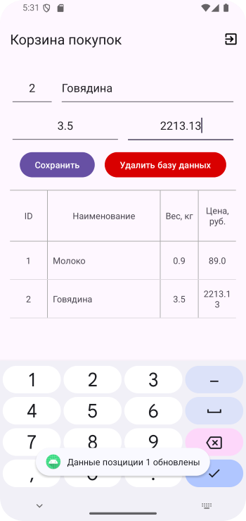
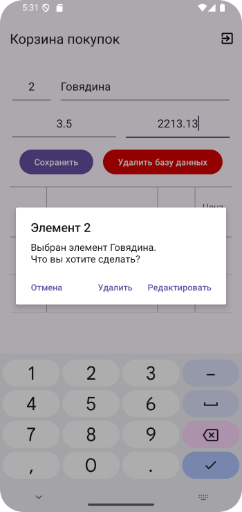
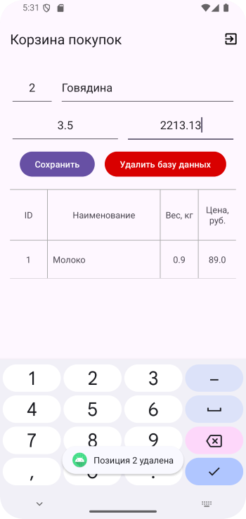
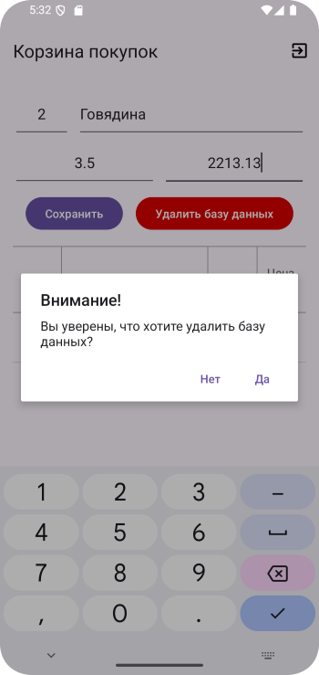

